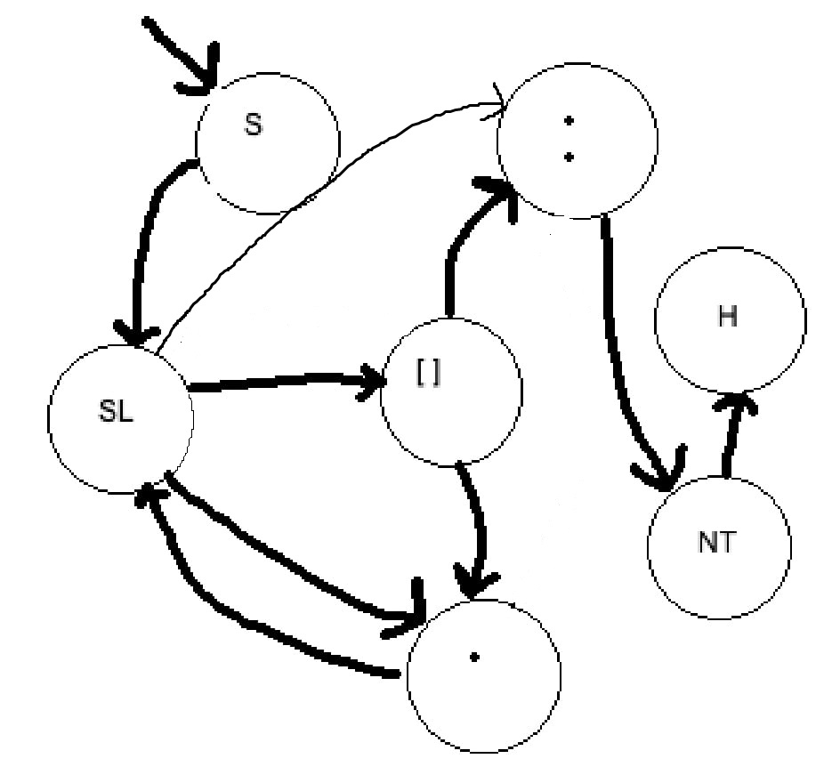

# JSON Type Checker

## Overview

This project implements a JSON type checker to validate JSON files against rules defined in JML format. The interpreter parses JML, validates JSON values against specified data types, and outputs the results.

## Features

- Parses custom JML syntax for validation rules.
- Validates JSON values against supported data types.
- Outputs results with color-coded feedback for easy readability.

## Project Structure

### Files

- **`syntaxParser.go`**: Contains JML parsing and validation logic.
- **`main.go`**: Handles input files, coordinates parsing, and displays results.
- **`fileOperator.go`**: Manages file operations like reading input files.

## Usage

### Command Line Usage

```go
go run . <input.jml> <input.json>
```

Example

example checker code

```go
func checkForString(selector string, m map[string]interface{}) bool {
	if _, ok := m[selector].(string); ok {
		return true
	}
	return false
}
```

example.jml

```go
$categories[].items[].id:number
$categories[].items[].name:string
$categories[].items[].details:object
```

example.json

```go
  "categories": [
    {
      "categoryName": "Electronics",
      "items": [
        {
          "id": 1,
          "name": "Smartphone",
```

Example output :

```
Validation Result: categories[].items[].id (pass)
DataType: number

Validation Result: categories[].items[].name (pass)
DataType: string

Validation Result: categories[].items[].details (pass)
DataType: object
```

## Implementation Details

### Core Modules

#### `syntaxParser.go`

- **`ParseCommand(input string) []Selector`**: Extracts validation rules from JML using regular expressions.
- **`checkSymbol(selector []string, dataType string) bool`**: Validates JSON values against data types.

#### `main.go`

- **File Reading**: Reads input JML and JSON files.
- **Validation Workflow**: Coordinates parsing and validation processes.
- **`printValidationResults(results []ValidationResult)`**: Formats and displays results with color-coded output.

#### `fileOperator.go`

- **`CheckFile(fileName string, fileType FileType) error`**: Ensures files exist and are valid.
- **`FillSelectors(content string, sel []Selector) []Selector`**: Updates selectors with parsed JSON data.

### Validation Logic

- Traverses JSON using dot-separated selectors.
- Handles arrays and nested properties using `[]` notation.
- Matches JSON values with JML-defined data types.

## Supported Data Types

- **`number`**: Matches numeric values.
- **`string`**: Matches string values.
- **`object`**: Matches JSON objects.
- **`boolean`**: True of false.

## Error Handling

### File Validation Errors

- Ensures input files are present and non-empty.

### Syntax Errors

- Reports invalid JML syntax with error messages.



$categories[].items[].id:number

$categories[].items[].name:string
